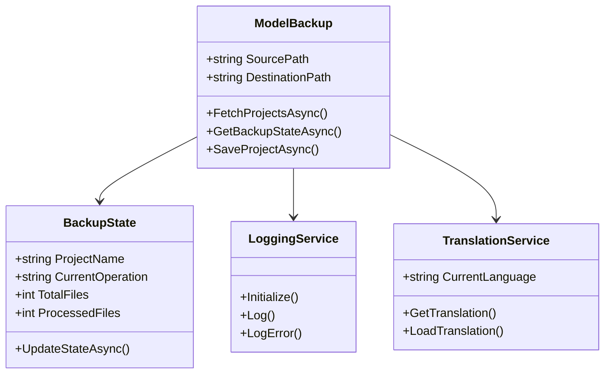
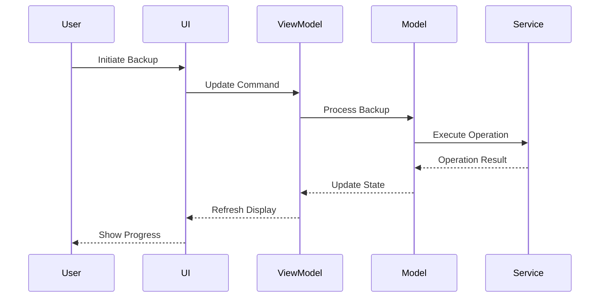

# EasySave Architecture Documentation

## Table of Contents
1. [System Overview](#system-overview)
2. [Architecture Patterns](#architecture-patterns)
3. [Component Design](#component-design)
4. [Data Flow](#data-flow)
5. [Security Architecture](#security-architecture)
6. [Deployment Architecture](#deployment-architecture)
7. [Diagrams](#diagrams)

## System Overview
EasySave is designed as a modern desktop application with a focus on scalability, maintainability, and user experience. The system is built using .NET Core and Avalonia UI, implementing the MVVM architectural pattern.

## Architecture Patterns

### MVVM Pattern
The application follows the Model-View-ViewModel pattern:
- **Models**: Data and business logic
- **Views**: User interface components
- **ViewModels**: Presentation logic and state management

### Service Layer Pattern
Core functionality is encapsulated in services:
- Translation management
- Encryption handling
- Logging
- State management

## Component Design

### Core Components
1. **Backup Engine**
   - Handles file operations
   - Manages backup states
   - Implements differential backup logic

2. **Configuration Manager**
   - User preferences
   - Application settings
   - System configuration

3. **Security Module**
   - File encryption
   - Process blocking
   - Access control

4. **Logging System**
   - Operation tracking
   - Error logging
   - Performance monitoring

### Interface Components
1. **Main Window**
   - Task management
   - Progress display
   - Status monitoring

2. **Configuration Interface**
   - Settings management
   - Language selection
   - Theme customization

3. **Backup Interface**
   - Task creation
   - Progress tracking
   - Operation control

## Data Flow

### Backup Process Flow
1. User initiates backup
2. System validates parameters
3. Backup engine processes files
4. Progress updates to UI
5. Logging system records operations
6. State manager updates status

### Configuration Flow
1. User modifies settings
2. Configuration manager validates changes
3. Settings are persisted
4. UI updates reflect changes
5. Services adapt to new configuration

## Security Architecture

### Encryption
- File-level encryption
- Secure key management
- Process isolation

### Access Control
- File permission management
- Process blocking during operations
- Secure configuration storage

## Deployment Architecture

### Application Structure
```
EasySave/
├── bin/              # Compiled binaries
├── lib/              # External libraries
├── Resources/        # Application resources
└── logs/            # Log files
```

### Dependencies
- .NET Core 7.0+
- Avalonia UI
- CryptoSoftLib
- JSON.NET

## Diagrams

### Use Case Diagram


### Activity Diagram


### Class Diagram


### Component Interaction

