# Project_GL
This repository contains the group-project of Seif, Achille, Vincent and Olaf for the software engineering bloc.

## UML diagrams
This part contains the UML diagrams of the save software.

#### Activity diagram

#### Class diagram

#### Sequence diagram

```mermaid
  %%{init: {
  'theme': 'base',
  'themeVariables': {
    'primaryColor': '#f4f4f4',
    'primaryTextColor': '#000000',
    'primaryBorderColor': '#000000',
    'lineColor': '#000000',
    'secondaryColor': '#f0f0f0',
    'tertiaryColor': '#ffffff'
  }
}}%%

sequenceDiagram
    actor User as User
    participant App as Terminal Application
    participant Sys as System (Local/Remote)
    participant Log as Logger
    participant Timer as Timer (15min)
    
    rect rgba(245, 245, 250, 0.3)
    Note over App: Application Started
    
    rect rgba(220, 220, 255, 0.5)
    Note right of User: Initialization Phase
    
    alt First Run - Configuration Missing
        App->>Sys: Fetch Configuration
        activate Sys
        Sys-->>App: Configuration Not Found
        deactivate Sys
        
        App->>User: Request Initial Setup
        activate User
        User->>App: Configure Directories A & B
        deactivate User
        
        App->>Sys: Save Configuration
        activate Sys
        Sys-->>App: Configuration Saved
        deactivate Sys
        
        App->>Log: Log: Initial Configuration Created
        activate Log
        deactivate Log
    else Configuration Exists
        App->>Sys: Fetch Configuration
        activate Sys
        Sys-->>App: Return Configuration
        deactivate Sys
        
        App->>Sys: Load Configuration
        activate Sys
        Sys-->>App: Configuration Loaded
        deactivate Sys
        
        App->>Log: Log: Configuration Loaded
        activate Log
        deactivate Log
    end
    
    App->>Sys: List Configured Projects
    activate Sys
    Sys-->>App: Return Project List (≤ 5)
    deactivate Sys
    
    App->>User: Display Project List
    App->>Log: Log: Projects Retrieved (n/5)
    activate Log
    deactivate Log
    end
    
    rect rgba(220, 255, 220, 0.5)
    Note right of User: Project Management
    
    opt Add New Project
        User->>App: Add New Project
        activate App
        App->>App: Check if Projects < 5
        
        alt Project Limit Not Reached
            App->>Sys: Add Project to Configuration
            activate Sys
            Sys-->>App: Project Added
            deactivate Sys
            
            App->>Log: Log: New Project Added
            activate Log
            deactivate Log
            
            App->>User: Confirm Project Addition
        else Project Limit Reached
            App->>User: Error: Maximum Project Limit Reached
            
            App->>Log: Log: Project Addition Failed - Limit Reached
            activate Log
            deactivate Log
        end
        deactivate App
    end
    
    opt Download Missing Project
        User->>App: Request Download of Project X
        activate App
        
        App->>Sys: Check Project X Availability
        activate Sys
        Sys-->>App: Project X Available
        deactivate Sys
        
        App->>Log: Log: Starting Download of Project X
        activate Log
        deactivate Log
        
        App->>Sys: Download Project X
        activate Sys
        Sys-->>App: Project X Data
        deactivate Sys
        
        App->>Sys: Install Project X in Directory A
        activate Sys
        Sys-->>App: Installation Complete
        deactivate Sys
        
        App->>Log: Log: Project X Installed
        activate Log
        deactivate Log
        
        App->>User: Confirm Project X Installation
        deactivate App
    end
    end
    
    rect rgba(255, 220, 220, 0.5)
    Note right of User: Manual Save Operation
    
    User->>App: Save Project
    activate App
    
    App->>Sys: Check Changes in Working Directory
    activate Sys
    Sys-->>App: List of Changed Files
    deactivate Sys
    
    alt Changes Detected
        App->>Sys: Copy New Version to Save Directory
        activate Sys
        Sys-->>App: Save Complete
        deactivate Sys
        
        App->>Log: Log: Major Version Saved
        activate Log
        deactivate Log
        
        App->>User: Confirm Save Operation
    else No Changes
        App->>User: No Changes to Save
        
        App->>Log: Log: Save Operation - No Changes
        activate Log
        deactivate Log
    end
    deactivate App
    end
    
    rect rgba(220, 220, 255, 0.5)
    Note right of User: Automatic Save Configuration
    
    User->>App: Toggle Auto-Save
    activate App
    
    App->>Timer: Start Timer (15min interval)
    activate Timer
    
    App->>Log: Log: Auto-Save Enabled
    activate Log
    deactivate Log
    
    App->>User: Confirm Auto-Save Enabled
    deactivate App
    
    loop Every 15 Minutes
        Timer->>App: Trigger Automatic Save
        activate App
        
        App->>Log: Log: Starting Auto-Save Cycle
        activate Log
        deactivate Log
        
        App->>Sys: Check Changes in Working Directory
        activate Sys
        Sys-->>App: List of Changed Files
        deactivate Sys
        
        alt Changes Detected
            App->>Sys: Copy Changes to Save Directory
            activate Sys
            Sys-->>App: Save Complete
            deactivate Sys
            
            App->>Log: Log: Auto-Save Complete
            activate Log
            deactivate Log
        else No Changes
            App->>Log: Log: Auto-Save - No Changes
            activate Log
            deactivate Log
        end
        deactivate App
    end
    deactivate Timer
    end
    
    rect rgba(255, 255, 220, 0.5)
    Note right of User: Application Termination
    
    User->>App: Close Application
    activate App
    
    App->>Sys: Perform Final Save
    activate Sys
    Sys-->>App: Final Save Complete
    deactivate Sys
    
    App->>Timer: Stop Timer
    activate Timer
    Timer-->>App: Timer Stopped
    deactivate Timer
    
    App->>Log: Log: Application Shutdown
    activate Log
    deactivate Log
    
    App->>User: Confirm Application Closed
    deactivate App
    end
    end

```

