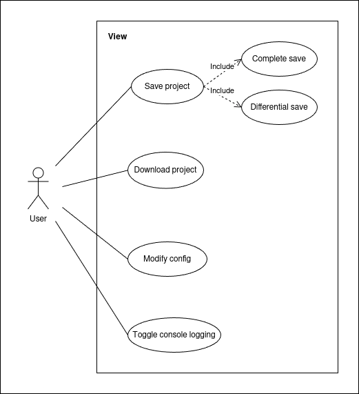
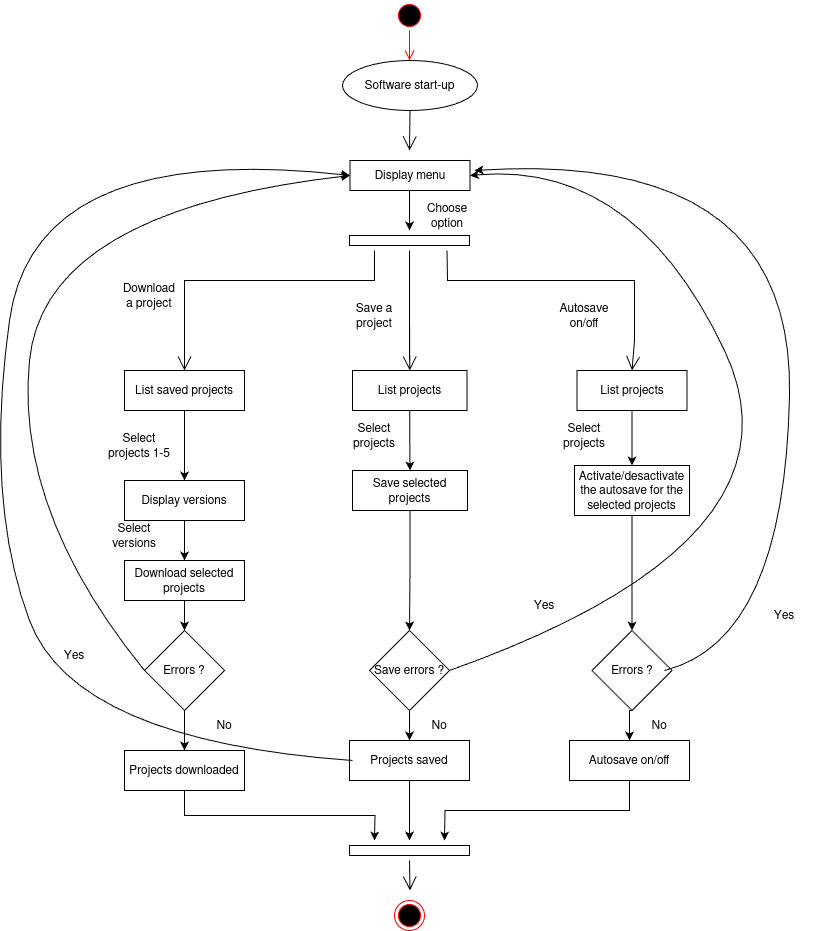
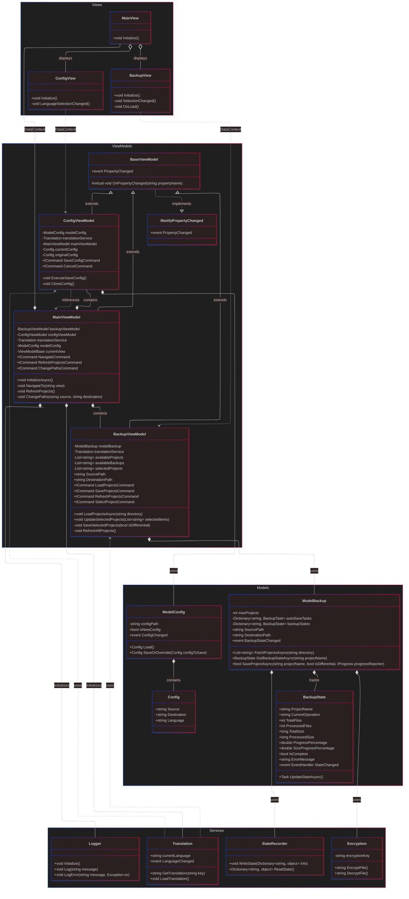

# EasySave 2.0
EasySave is a powerful versioning and saving software designed to streamline project management and development workflows. Its core features include advanced saving utilities, comprehensive versioning tools, and a robust, lightweight architecture built on state-of-the-art development practices.

With EasySave, users benefit from efficient file management, secure version control, and a seamless user experience, making it an essential tool for developers and teams who prioritize efficiency, organization, and data integrity.

## Contributors
The main contributors in this project are Olaf, Vincent, Seif & Achile.

# Version 2.0 Specifications

EasySave version 2.0 is a modern desktop application built using .NET Core and Avalonia UI, providing an intuitive graphical interface while maintaining all the powerful features of version 1.0. This version includes significant improvements and new features:

### Core Features

#### Backup Management
- Support for unlimited backup tasks, each defined by:
  - A unique backup name
  - A source directory
  - A target directory
  - Backup type (full or differential)
  - Real-time progress tracking
  - Detailed backup history

#### Enhanced Security
- File encryption using CryptoSoftLib
- Secure handling of sensitive data
- Process blocking during critical operations
- Comprehensive error handling and recovery

#### Multilingual Support
- Full support for English, French, and Welsh
- Dynamic language switching
- Fallback to English for missing translations
- Translation caching for improved performance

#### Modern User Interface
- Clean and intuitive Avalonia-based GUI
- Real-time progress visualization
- Drag-and-drop support
- Dark/Light theme support
- Responsive design

#### Advanced File Operations
- Support for local, external, and network drives
- Differential backup optimization
- Automatic file conflict resolution
- Progress tracking for large operations

#### Comprehensive Logging System
- Real-time logging of all operations
- Detailed error tracking and reporting
- JSON-based log format for easy parsing
- Configurable log locations
- Log rotation and management

#### State Management
- Real-time backup state tracking
- Progress monitoring
- Error state handling
- State persistence between sessions

### Technical Improvements

#### Error Handling
- Comprehensive try-catch blocks
- Detailed error messages
- Graceful error recovery
- User-friendly error notifications

#### Performance
- Asynchronous operations
- Progress tracking
- Efficient file operations
- Memory optimization

#### Code Quality
- Clean architecture (MVVM pattern)
- Comprehensive documentation
- Unit test coverage
- Code consistency

## System Requirements

- Windows 10/11, macOS 10.15+, or Linux
- .NET 7.0 or later
- 4GB RAM minimum
- 500MB free disk space

## Installation

1. Download the latest release from the releases page
2. Extract the archive to your desired location
3. Run EasySave.exe (Windows) or EasySave (macOS/Linux)

## Usage

1. Launch the application
2. Configure your backup tasks using the intuitive interface
3. Select your desired language
4. Start your backup operations
5. Monitor progress in real-time
6. View detailed logs and history

## Development

### Prerequisites
- .NET 9.0 SDK
- Visual Studio 2022 or JetBrains Rider
- Git

### Building from Source
```bash
git clone https://github.com/saadaouis/Projet_GL.git
cd Projet_GL
dotnet restore
dotnet build
```

### Running Tests
```bash
dotnet test
```

## Architecture

The application follows a clean architecture pattern with the following components:

### Models
- `ModelBackup`: Manages backup operations
- `ModelConfig`: Handles configuration
- `BackupState`: Tracks backup state

### Services
- `TranslationService`: Manages multilingual support
- `CryptosoftService`: Handles file encryption
- `LoggingService`: Manages logging
- `StateRecorder`: Tracks application state

### ViewModels
- `MainViewModel`: Main application logic
- `BackupViewModel`: Backup operations
- `ConfigViewModel`: Configuration management

### Views
- `MainView`: Main application window
- `BackupView`: Backup management interface
- `ConfigView`: Configuration interface

## Contributing

1. Fork the repository
2. Create a feature branch
3. Commit your changes
4. Push to the branch
5. Create a Pull Request

## License

This project is licensed under the MIT License - see the LICENSE file for details.

## Understanding the Architecture
This part concerns the software architecture & design choices for this project. We decided to follow a MVC type architecture to ensure maximum scalability for future developpers and users. We also choose to add a few more features to the project that we deemed necessary for a complete MVP version of EasySave.

- AutoSaving feature [ON/OFF] V1.0
- Possibility to access distant directories using SSH Connections V2.0
- Ability to download projects (Mainly usefull in distant directories)V1.0

## Use case diagram
The Use Case Diagram represent the several interactions the user have with the application. It shows all of the options the user can choose from.



## Activity diagram
The Activity Diagram outlines the flow of actions within Easysave, from initialization to performing backup tasks. It provides a clear view of how user actions translate into system processes, showing decision points, process flows, and data interactions between the core components.




## Class diagram
The Class Diagram illustrates the main components of the Easysave application and their interactions:

- Controller: Manages user inputs, coordinates between the Model (Backup, Config) and View components.

- View: Handles user interactions and displays messages or options.

- ModelBackup: Manages backup operations, including executing, running, and autosaving backups.

- ModelConfig: Manages the configuration settings, including loading and saving configurations.

- BackupState: Tracks the state of each backup, including job name, progress, and file details.

- BackupLog: Manages log entries for backup operations, including timestamp, file size, and transfer time.

- Logger: Records all actions and events, ensuring detailed traceability.


## Sequence diagram
This sequence diagram illustrates the complete data flow and interactions between the main classes of EasySave during a typical user session. It captures the user's interactions with the system, how requests are processed, and how the system components (Model, View, Controller, Logger, and System) communicate to perform tasks like initialization, backup management, and configuration.

```mermaid
---
config:
  theme: dark
---

sequenceDiagram
    actor U as User
    participant I as IHM
    participant M as Main
    participant V as View
    participant C as Controller
    participant MC as Model Config
    participant MB as Model Backup
    participant S as System
    participant L as Logger
    
    rect rgba(245, 245, 250, 0.3)
    activate U
    
    rect rgba(220, 220, 255, 0.5)
    Note right of U: Initialization Phase
        U->>M: Start App
        activate M
        M->>C: initializationProcess()
        activate C
        C->>MC: fetchConfig()
        activate MC
        MC-->>C: Config not found
        C->>L: Log("Config not found", "ERROR")
        activate L
        deactivate L
        C->>V: initializationForm()
        activate V
        V->>I: Display the config form
        activate I 
        I->>U: Request Initial Config
        
        U-->>I: Configure Directories A-B & Language
        I-->>V: Completed Initial Config
        V-->>C: Completed initializationForm()

        C->>MC: setConfig(directoryA: string, directoryB: string, language: string)
        MC-->>C: Config Saved Successfully
        C->>L: Log("Config Saved", "INFO")
        activate L
        deactivate L
        C->>MC: loadConfig()
        MC-->>C: Config Loaded
        deactivate MC
        C->>L: Log("Config Loaded", "INFO")
        activate L
        deactivate L
    end

    rect rgba(246, 66, 105, 0.2)
    Note right of U: System Menu
    C->>V: displayMenu()
    V->>I: Display Option Menu
    I->>U: Request to choose an option from the menu
    U-->>I: Choose Option between 1-5
    I-->>V: Completed Option Menu
    V-->>C: displayMenu() Output
    C->>L: Log("Option " + option + " selected", "INFO")
    activate L
    deactivate L
    end

    alt Option 1
    rect rgba(146, 36, 200, 0.2)
    Note right of U: Option 1 : Download Project
    C->>V: showProjectList()
    V->>I: Display Project List
    I->>U: Request to choose a project
    U-->>I: Choose Between 1-5
    I-->>V: Selected Project n
    V-->>C: showProjectList() Output
    C->>L: Log("Project " + projectId + " selected", "INFO")
    activate L
    deactivate L
    C->>MB: fetchVersionList(projectId: int)
    activate MB
    MB-->>C: List of project versions
    deactivate MB
    C->>V: showVersionList(versions: List<Version>)
    V->>I: Display options
    I->>U: Request to choose a version
    U-->>I: Version n
    I-->>V: Version n selected
    V-->>C: showVersionList() Output
    C->>L: Log("Version " + versionId + " selected", "INFO")
    activate L
    deactivate L
    C->>MB: getVersion(projectId: int, versionId: int)
    activate MB
    MB-->>C: Beginning download of project
    C->>L: Log("Starting Download for project " + projectId + " version " + versionId, "INFO")
    activate L
    deactivate L
    MB->>S: Copy file from directory B to A
    activate S
    C->>V: displayMessage("Starting Download")
    V->>I: Display Starting Download
    I->>U: Starting Download
    
    S-->>MB: Finished copying file from B to A
    deactivate S
    MB-->>C: Download Finished
    deactivate MB
    C->>L: Log("Download for project " + projectId + " version " + versionId + " successful", "INFO")
    activate L
    deactivate L
    C->>V: displayMessage("Download Finished")
    V->>I: Display Download Finished
    I->>U: Download Finished
    end
    end

    alt Option 2
    rect rgba(146, 206, 200, 0.2)
    Note right of U: Option 2 : Save Project
    C->>V: showProjectList()
    V->>I: Display Project List
    I->>U: Request to choose a project
    U-->>I: Choose Between 1-5
    I-->>V: Selected Project n
    V-->>C: showProjectList() Output
    C->>L: Log("Project " + projectId + " selected", "INFO")
    activate L
    deactivate L
    C->>MB: createSave(projectId: int)
    activate MB
    MB-->>C: Beginning save of project
    C->>L: Log("Starting save for project " + projectId + " version N+1", "INFO")
    activate L
    deactivate L
    MB->>S: Copy file from directory A to B
    activate S
    C->>V: displayMessage("Saving...")
    V->>I: Display Saving
    I->>U: Saving...
    
    S-->>MB: Finished copying file from A to B
    deactivate S
    MB-->>C: Save Finished
    deactivate MB
    C->>L: Log("Save for project " + projectId + " version N+1 successful", "INFO")
    activate L
    deactivate L
    C->>V: displayMessage("Finished Saving")
    V->>I: Display Finished Saving
    I->>U: Finished Saving
    end
    end

    alt Option 3
    rect rgba(226, 226, 226, 0.2)
    Note right of U: Option 3 : Enable Auto-Saving
    C->>V: showProjectList()
    V->>I: Display Project List
    I->>U: Select one or multiple projects
    U-->>I: Choose Projects (Toggle)
    I-->>V: Selected Projects
    V-->>C: Project List Selected
    C->>L: Log("Selected Project List: " + projectIds, "INFO")
    activate L
    deactivate L
    
    C->>MB: activateAutoSave(projects: List<Project>)
    activate MB
    MB-->>C: Auto-Save enabled for n projects
    C->>V: displayMessage("Auto-Save enabled for " + n + " projects")
    V->>I: Display "Auto-Save enabled for " + n + " projects"
    I->>U: Auto-Save activated for n projects
    
    loop Auto-Saving (every 15 minutes)
        MB-->>MB: Wait 15 minutes
        loop For each selected project
            MB->>S: Compare Directory A with Latest Major Version
            S-->>MB: Return Differences
            MB->>S: Save New Version (v.x.n+1) in Project Directory
            MB-->>C: Project n successfully updated
            C->>L: Log("Project " + projectId + " successfully updated", "INFO")
        end
        MB-->>C: Successful 15mn update loop
        C->>L: Log("All projects successfully updated", "INFO")
    end
    
    deactivate MB
    end
    end

    alt Option 4
    rect rgba(50, 50, 50, 0.2)
    Note right of U: Option 4 : Config Modification
    C->>V: showConfigForm()
    V->>I: Display Config Form
    I->>U: Request to modify config
    U-->>I: Modify Directories A-B & Language
    I-->>V: Completed Config Modification
    V-->>C: showConfigForm() Output
    C->>L: Log("Config modification requested", "INFO")
    activate L
    deactivate L
    C->>MC: updateConfig(directoryA: string, directoryB: string, language: string)
    activate MC
    MC-->>C: Config Updated Successfully
    deactivate MC
    C->>L: Log("Config updated successfully", "INFO")
    activate L
    deactivate L
    C->>V: displayMessage("Config updated successfully")
    V->>I: Display Config Updated
    I->>U: Config Updated Successfully
    end
    end

    alt Option 5
    rect rgba(240, 235, 80, 0.2)
    Note right of U: Option 5 : Quit Program
    C->>V: confirmQuit()
    V->>I: Display Quit Confirmation
    I->>U: Request confirmation to quit
    U-->>I: Confirm Quit
    I-->>V: Quit Confirmed
    V-->>C: confirmQuit() Output
    deactivate V
    C->>L: Log("Program termination requested", "INFO")
    activate L
    deactivate L
    C-->>M: return
    deactivate C
    M->>I: Close Application
    deactivate I
    deactivate M
    end
    end

    deactivate U
    end

```

