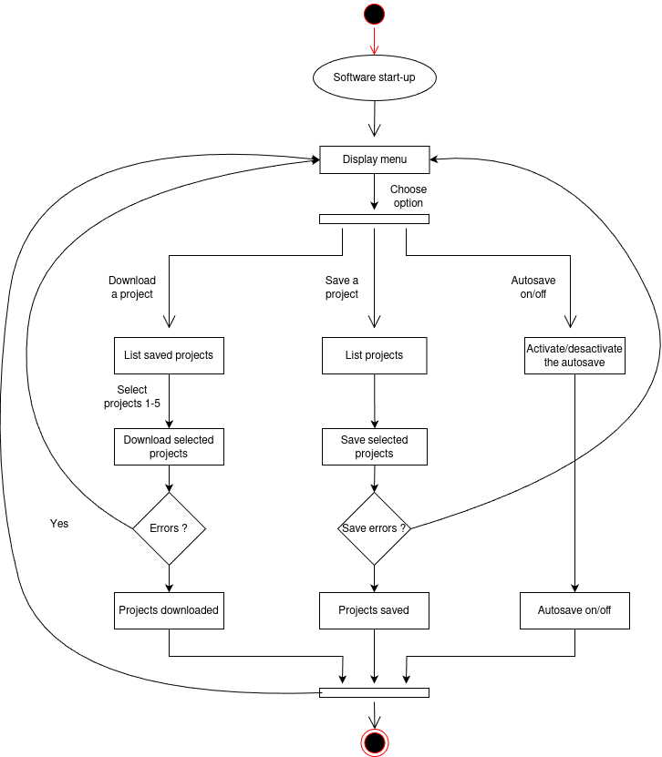

# Project_GL
This repository contains the group-project of Seif, Achille, Vincent and Olaf for the software engineering bloc.

## UML diagrams
This part contains the UML diagrams of the save software.

#### Activity diagram


#### Class diagram


#### Sequence diagram
```mermaid
  %%{init: {
  'theme': 'dark',
  'themeVariables': {
    'primaryColor': '#f4f4f4',
    'primaryTextColor': '#000000',
    'primaryBorderColor': '#000000',
    'lineColor': '#000000',
    'secondaryColor': '#f0f0f0',
    'tertiaryColor': '#ffffff'
  }
}}%%

sequenceDiagram
    participant User as User
    participant App as Terminal Application
    participant Sys as System (Local/Remote)
    participant Log as Logger
    participant Timer as Timer (15min)
    
    rect rgba(245, 245, 250, 0.3)
    Note over App: Application Started
    
    rect rgba(220, 220, 255, 0.5)
    Note right of User: Initialization Phase
    
    alt First Run - Configuration Missing
        App->>Sys: Fetch Configuration
        activate Sys
        Sys-->>App: Configuration Not Found
        deactivate Sys
        
        App->>User: Request Initial Setup
        activate User
        User->>App: Configure Directories A & B
        deactivate User
        
        App->>Sys: Save Configuration
        activate Sys
        Sys-->>App: Configuration Saved
        deactivate Sys
        
        App->>Log: Log: Initial Configuration Created
        activate Log
        deactivate Log
    else Configuration Exists
        App->>Sys: Fetch Configuration
        activate Sys
        Sys-->>App: Return Configuration
        deactivate Sys
        
        App->>Sys: Load Configuration
        activate Sys
        Sys-->>App: Configuration Loaded
        deactivate Sys
        
        App->>Log: Log: Configuration Loaded
        activate Log
        deactivate Log
    end
    
    App->>Sys: List Configured Projects
    activate Sys
    Sys-->>App: Return Project List (≤ 5)
    deactivate Sys
    
    App->>User: Display Project List
    App->>Log: Log: Projects Retrieved (n/5)
    activate Log
    deactivate Log
    end
    
    rect rgba(220, 255, 220, 0.5)
    Note right of User: Project Management
    
    opt Add New Project
        User->>App: Add New Project
        activate App
        App->>App: Check if Projects < 5
        
        alt Project Limit Not Reached
            App->>Sys: Add Project to Configuration
            activate Sys
            Sys-->>App: Project Added
            deactivate Sys
            
            App->>Log: Log: New Project Added
            activate Log
            deactivate Log
            
            App->>User: Confirm Project Addition
        else Project Limit Reached
            App->>User: Error: Maximum Project Limit Reached
            
            App->>Log: Log: Project Addition Failed - Limit Reached
            activate Log
            deactivate Log
        end
        deactivate App
    end
...