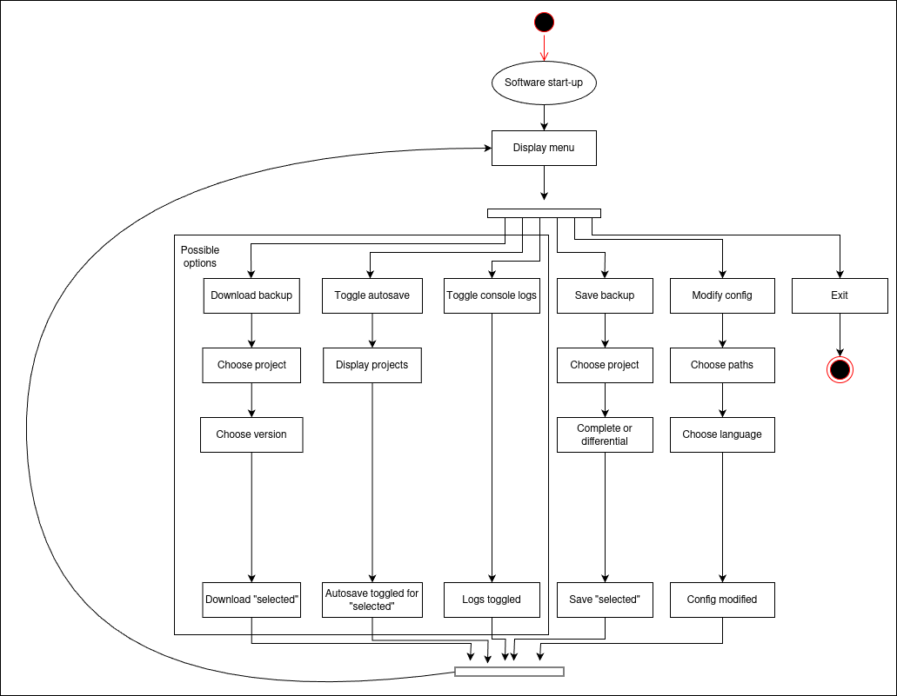
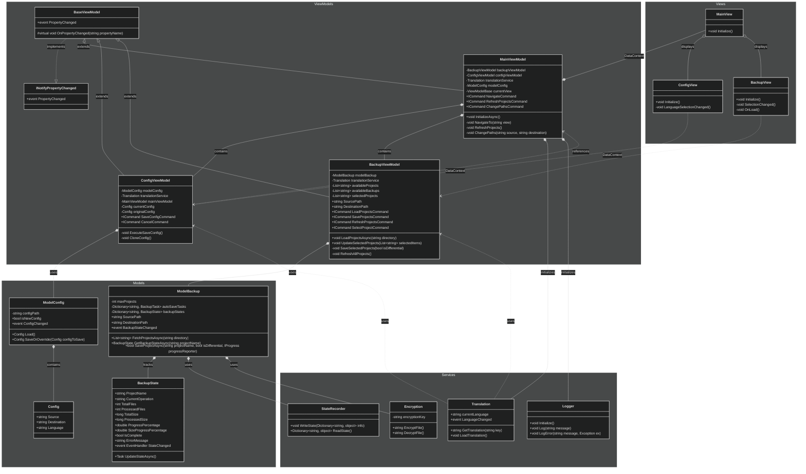

# EasySave 1.0 
Easysave is a powerful versioning and saving software designed to streamline project management and development workflows. Its core features include advanced saving utilities, comprehensive versioning tools, and a robust, lightweight architecture built on state-of-the-art development practices.

With Easysave, users benefit from efficient file management, secure version control, and a seamless user experience, making it an essential tool for developers and teams who prioritize efficiency, organization, and data integrity

## Contributors
The main contributors in this project are Olaf, Vincent, Seif & Achile.
# Version 1.0 Specifications

Easysave version 1.0 is a console application built using .NET Core, designed to provide efficient and reliable backup management. This initial version includes the following features:

#### Supports up to 5 backup tasks, each defined by:

- A unique backup name.

- A source directory.

- A target directory.

- Backup type (full or differential).

#### Multilingual support for English and French users.

#### Command-line operation, allowing:

- Sequential execution of backups (e.g., 1-3 to run backups 1 to 3).

- Selective execution of specific backups (e.g., 1;3 to run backups 1 and 3).

#### Supports source and target directories on:

- Local drives.

- External drives.

- Network drives.

#### Comprehensive logging system:

- Real-time logging of all backup actions (file transfers, directory creation, etc.).

- Minimum log details include timestamp, backup name, source and destination paths, file size, and transfer time.

Log entries are stored in a daily JSON file, designed for compatibility with future projects.

#### Real-time status file:

Tracks progress and status of each backup job.

Records total files, transfer size, remaining files, and active file details.

JSON format for logs and status files with line breaks for readability.

Configurable log and status file locations, avoiding hardcoded paths like "C:\temp" to ensure compatibility with client servers.

**This foundational version ensures a balance between simplicity and functionality, setting a solid base for future enhancements, including a potential GUI in version 2.0.**

## Understanding the Architecture
This part concerns the software architecture & design choices for this project. We decided to follow a MVC type architecture to ensure maximum scalability for future developpers and users. We also choose to add a few more features to the project that we deemed necessary for a complete MVP version of EasySave.

- AutoSaving feature [ON/OFF] V1.0
- Possibility to access distant directories using SSH Connections V2.0
- Ability to download projects (Mainly usefull in distant directories)V1.0

## Use case diagram
The Use Case Diagram represent the several interactions the user have with the application. It shows all of the options the user can choose from.

## Activity diagram
The Activity Diagram outlines the flow of actions within Easysave, from initialization to performing backup tasks. It provides a clear view of how user actions translate into system processes, showing decision points, process flows, and data interactions between the core components.

## Class diagram
The Class Diagram illustrates the main components of the Easysave application and their interactions:

- Controller: Manages user inputs, coordinates between the Model (Backup, Config) and View components.

- View: Handles user interactions and displays messages or options.

- ModelBackup: Manages backup operations, including executing, running, and autosaving backups.

- ModelConfig: Manages the configuration settings, including loading and saving configurations.

- BackupState: Tracks the state of each backup, including job name, progress, and file details.

- BackupLog: Manages log entries for backup operations, including timestamp, file size, and transfer time.

- Logger: Records all actions and events, ensuring detailed traceability.

## Sequence diagram
This sequence diagram illustrates the complete data flow and interactions between the main classes of EasySave during a typical user session. It captures the user’s interactions with the system, how requests are processed, and how the system components (Model, View, Controller, Logger, and System) communicate to perform tasks like initialization, backup management, and configuration.

