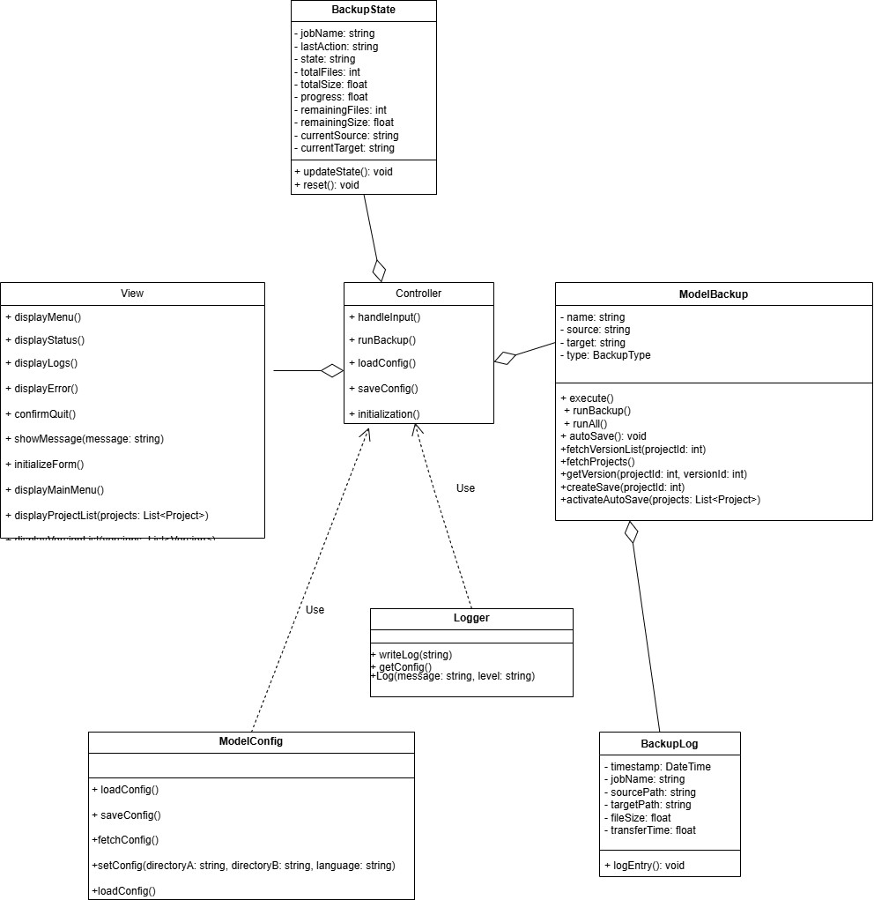

# Project_GL
This repository contains the group-project of Seif, Achille, Vincent and Olaf for the software engineering bloc.

## UML diagrams
This part contains the UML diagrams of the save software.

#### Activity diagram


#### Class diagram


#### Sequence diagram
# Projet_GL test
Ce repository contient le projet en groupe de Saifallah, Achille, Vincent, Olaf et Seif pour le bloc genie logiciel en C#

```mermaid
  %%{init: {
  'theme': 'base',
  'themeVariables': {
    'primaryColor': '#f4f4f4',
    'primaryTextColor': '#000000',
    'primaryBorderColor': '#000000',
    'lineColor': '#000000',
    'secondaryColor': '#f0f0f0',
    'tertiaryColor': '#ffffff'
  }
}}%%

sequenceDiagram
    actor U as User
    participant I as IHM
    participant M as Main
    participant V as View
    participant C as Controller
    participant MC as Model Config
    participant MB as Model Backup
    participant S as System
    participant L as Logger
    
    rect rgba(245, 245, 250, 0.3)
    activate U
    
    rect rgba(220, 220, 255, 0.5)
    Note right of U: Initialization Phase
        U->>M: Start App
        activate M
        M->>C: initializationProcess()
        activate C
        C->>MC: fetchConfig()
        activate MC
        MC-->>C: Config not found
        C->>L: Log("Config not found", "ERROR")
        activate L
        deactivate L
        C->>V: initializationForm()
        activate V
        V->>I: Display the config form
        activate I 
        I->>U: Request Initial Config
        
        U-->>I: Configure Directories A-B & Language
        I-->>V: Completed Initial Config
        V-->>C: Completed initializationForm()

        C->>MC: setConfig(directoryA: string, directoryB: string, language: string)
        MC-->>C: Config Saved Successfully
        C->>L: Log("Config Saved", "INFO")
        activate L
        deactivate L
        C->>MC: loadConfig()
        MC-->>C: Config Loaded
        deactivate MC
        C->>L: Log("Config Loaded", "INFO")
        activate L
        deactivate L
    end

    rect rgba(246, 66, 105, 0.2)
    Note right of U: System Menu
    C->>V: displayMenu()
    V->>I: Display Option Menu
    I->>U: Request to choose an option from the menu
    U-->>I: Choose Option between 1-5
    I-->>V: Completed Option Menu
    V-->>C: displayMenu() Output
    C->>L: Log("Option " + option + " selected", "INFO")
    activate L
    deactivate L
    end

    alt Option 1
    rect rgba(146, 36, 200, 0.2)
    Note right of U: Option 1 : Download Project
    C->>V: showProjectList()
    V->>I: Display Project List
    I->>U: Request to choose a project
    U-->>I: Choose Between 1-5
    I-->>V: Selected Project n
    V-->>C: showProjectList() Output
    C->>L: Log("Project " + projectId + " selected", "INFO")
    activate L
    deactivate L
    C->>MB: fetchVersionList(projectId: int)
    activate MB
    MB-->>C: List of project versions
    deactivate MB
    C->>V: showVersionList(versions: List<Version>)
    V->>I: Display options
    I->>U: Request to choose a version
    U-->>I: Version n
    I-->>V: Version n selected
    V-->>C: showVersionList() Output
...
